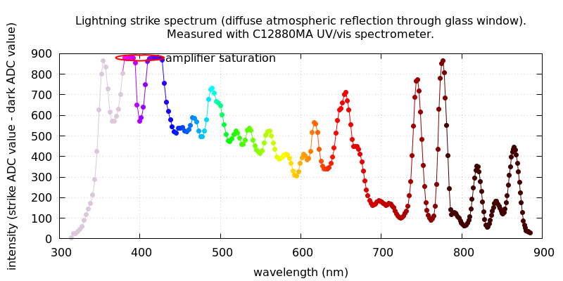

Spectrometer looking out through window, but now with poor view of sky. Light would be that 
reflected from clouds etc and not a direct view of the strike.

Storm on night/early morning of 2024-08-12.

Spectrum peaks at wavelenghts (nm):

354
386
418
490
618
656
745
777
820
866

